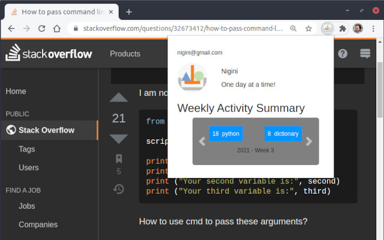

## Welcome to STAKO

Our goal is to add to your experience as an Stack Overflow user while supporting the site's inclusivity efforts. STAKO does that by analyzing Q&A page visits, testing new engagement strategies, and providing you with personalized feedback.

STAKO stores your Stack Overflow visits, provides personalized statistics, and adds to your experience of Stack Overflow Q&A pages.

### Participate

This is part of a University of Washington research project. To check out the consent form and participante, please visit our recruitment form [HERE](https://forms.gle/DWYvV1jnst6d27rk9).

## Privacy Policy

All STAKO data collection was reviewed and approved by the [Human Subjects Division at UW](https://www.washington.edu/research/hsd/).
In the following we highlight the major points of our **Privacy Policy**. You can read the full document [HERE](./privacy.html).

**SUMMARY:** 

  * STAKO is composed of this website and a companion browser plugin component. 
  * We strive to use industry accepted mean to protect your data through encrypted channels and data anonymization. 
  * The few pieces of non-anonymous information we collect (like your email) are only used to matter directly related to your use of STAKO.
  * Your data will only be used in aggregate and/or anonymous manner, by our small research team, for research purposes.
  * We will NEVER commercialize you data.
